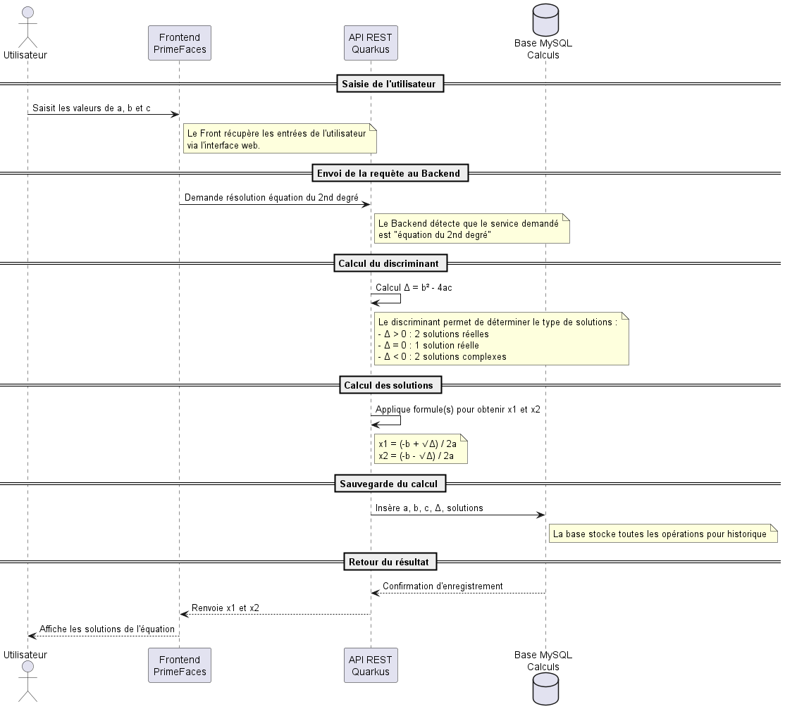
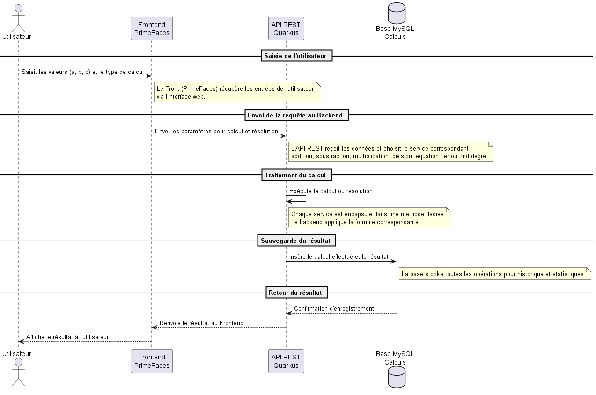
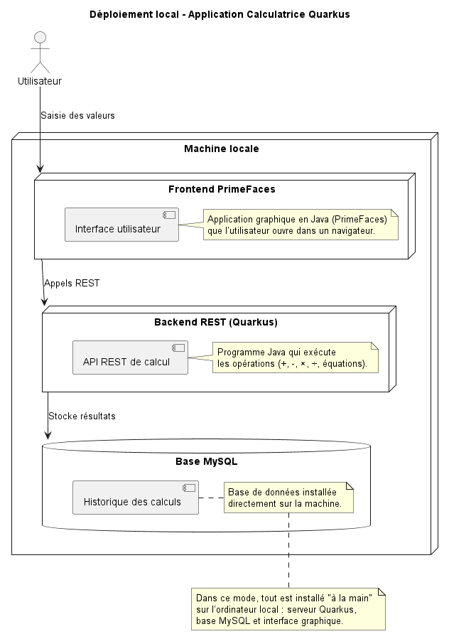
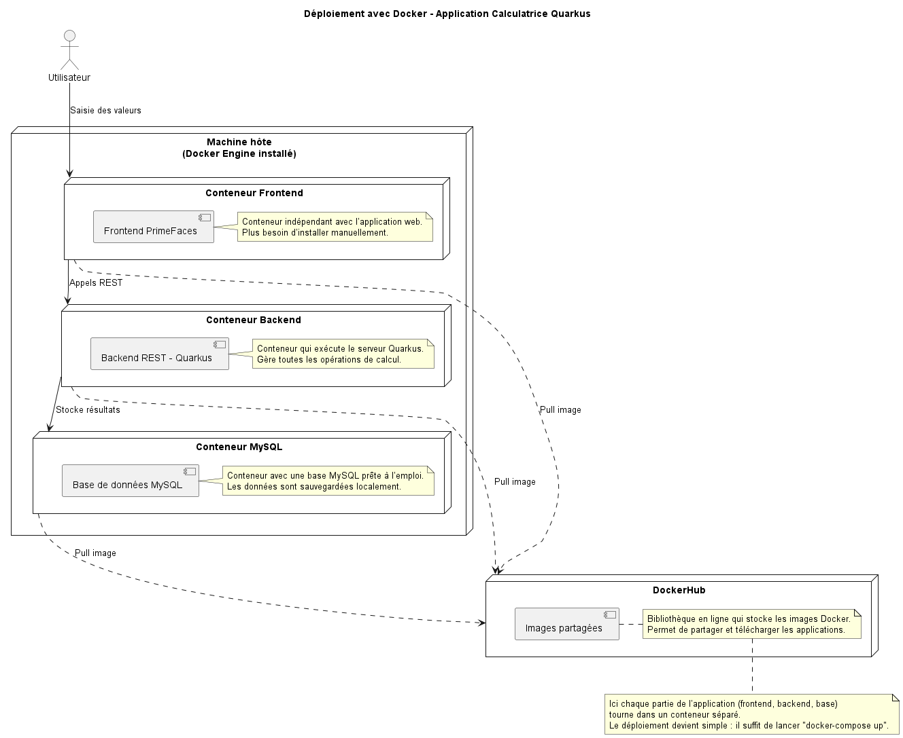

# Serveur Quarkus - Application Calculatrice

Ce dépôt contient le **serveur Quarkus** pour l'application Calculatrice.  
Il fournit des services REST pour effectuer des opérations mathématiques et résoudre des équations du premier et second degré. La base de données MySQL stocke l'historique des calculs.

---

## Fonctionnalités du serveur

Le serveur expose les fonctionnalités suivantes via **API REST** :

- **Addition** (`add`)
- **Soustraction** (`sub`)
- **Multiplication** (`mul`)
- **Division** (`div`)
- **Résolution d'équation du 1er degré** (`eq1`)
- **Résolution d'équation du 2nd degré** (`eq2`)
- **Stockage de l’historique des calculs** dans MySQL

Chaque service peut être appelé depuis le frontend PrimeFaces ou tout autre client HTTP.

---

## Diagrammes explicatifs

### 1️⃣ Diagramme de séquence - Résolution d'équation 2nd degré
Montre le flux depuis la saisie par l’utilisateur jusqu’au calcul et stockage en base.



---

### 2️⃣ Diagramme de séquence global
Montre le flux général pour tous les services du serveur.



---

### 3️⃣ Diagramme de déploiement local
Illustration de l’architecture lorsque le serveur, la base de données et le frontend sont installés directement sur la machine.



---

### 4️⃣ Diagramme de déploiement Docker
Illustration de l’architecture déployée avec Docker, incluant les conteneurs pour le frontend, le backend et la base de données.



---

## Instructions pour exécuter le serveur

### En local
1. Installer Java 21 et Maven.
2. Configurer MySQL.
3. Lancer le serveur Quarkus :  
```bash
mvn quarkus:dev
